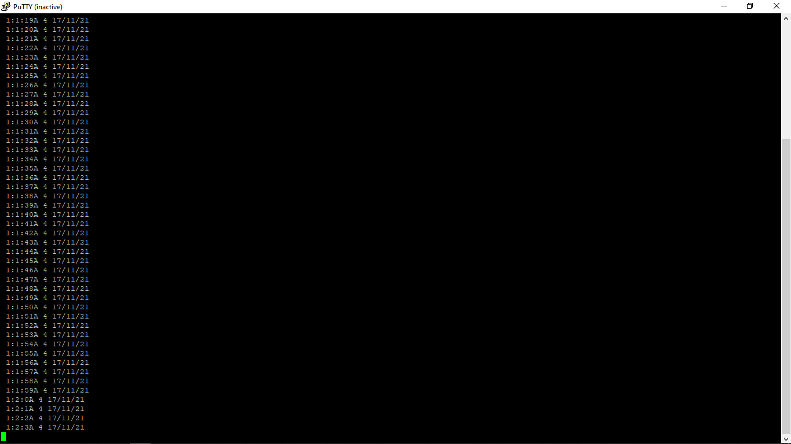

# Bits_of_Clockwork 
[](https://choosealicense.com/licenses/mit/)


A HAL-based library for interfacing Maxim Integrated's DS1307 Real-time Clock IC with STM32 via I2C.

## Table of Contents
- [Features](https://github.com/skuodi/Bits_of_Clockwork#features)
- [Installation](https://github.com/skuodi/Bits_of_Clockwork#installation)
- [API Reference](https://github.com/skuodi/Bits_of_Clockwork#api-reference)
- [Usage Examples](https://github.com/skuodi/Bits_of_Clockwork#usage-examples)
- [License](https://github.com/skuodi/Bits_of_Clockwork#license)

## Features

- Set second, minute, hour, day date, month and year all in one command.
- Read decoded values of time.
- Set square-wave output settings. 


## Installation

1. Copy the DS1307.h file into 
```
    [Your Project Folder] > Core > Inc 
```
2. Copy the DS1307.c file into 
```
    [Your Project Folder] > Core > Src
```

3. Line 16 of DS1307.h specifies the HAL library for the STM32 board in use.
    Change it as per your hardware.

    ```c
    #include "stm32f1xx_hal.h"						//HAL library for the bluepill(STM32F103C8)
    ```

4. The next line specifies the handle of the I2C bus in use. Change it as per your schematic.
    
    ```c
    extern I2C_HandleTypeDef hi2c2;					//handle for the i2c2 bus connected to my DS1307
    ```
## API Reference

#### readTime

Takes an 8-byte array and populates it with decimal values of [second,minute,hour,day,date,month,year, square-wave settings] read from the RTC

```c
void readTime(uint8_t allTime[8])
```

| Parameter | Type     	| Description                
| :-------- | :------- 	| :------------------------- 
| `alltime` | `uint8_t*`| Holds the data read.

#### getSeconds

Takes DS1307 seconds register bits and returns the corresponding decimal value.

```c
uint8_t getSeconds(uint8_t inTime)
```

| Parameter | Type     | Description                
| :-------- | :------- | :------------------------- 
| `inTime`  | `uint8_t`| Bits from the DS1307 seconds register.


####  getHours

Takes DS1307 hours register bits and returns the corresponding decimal value.

```c
uint8_t getHours(uint8_t inTime)
```

| Parameter | Type     | Description                
| :-------- | :------- | :------------------------- 
| `inTime`  | `uint8_t`| Bits from the DS1307 hours register.


### getMeridian

Determines whether the RTC is in 12 or 24-hour 

```c
char getMeridian()
```
- Returns `H` to indicate 24-hour mode and `A` or `P` indicating 12-hour mode AM or PM.

### getTime

Takes DS1307 minute/day/date/month/year register values and returns a corresponding decimal value.

```c
uint8_t getTime(uint8_t inTime)
```

| Parameter | Type     | Description                
| :-------- | :------- | :------------------------- 
| `inTime`  | `uint8_t`| Bits from the minute or day or date or month or year register.


### setTime

Takes decimal values of [second,minute,hour,day,date,month,year, square-wave settings] and 12/24-hour clock setting and writes them to the RTC

```c
setTime(uint8_t timeSet[8], char meridian)
```

| Parameter | Type     	| Description                
| :-------- | :------- 	| :------------------------- 
| `timeSet` | `uint8_t*`| Holds the data to be written to the timekeeper registers.
| `meridian`|   `char`	| For the 12 or 24-hour setting.


## Usage Examples
Setting the time
```c
	uint8_t pData[] = {0,1,1,4,17,11,21,0b00000011 };	// {sec,min,hour,day date, month,year, squarewave enable 32.768kHz}
	setTime(pData, 'A');								// 01:01:00AM 4 17/11/2021 

```
- The representation of day of the week is arbitrary but must be sequential...to wit,
	if 1 corresponds to Monday, 2 will be Tuesday 


Reading the time
```c
	uint8_t rData[8]={0};			//holds timekeeper register values
	uint8_t deBug[30]={0};			//holds string to be printed for dedugging
	char meridian;					// 12/24hr more

	readTime(rData);
	meridian = getMeridian();
	sprintf((char *)deBug, " %i:%i:%i%c %i %i/%i/%i\r\n", rData[2], rData[1], rData[0], meridian,rData[3],rData[4],rData[5],rData[6]);
	CDC_Transmit_FS(deBug, 25);

```
- Here's the output of this code running on a Bluepill configured as a USB Communication Device (Virtual Com Port).
	
## License

[MIT](https://choosealicense.com/licenses/mit/)

